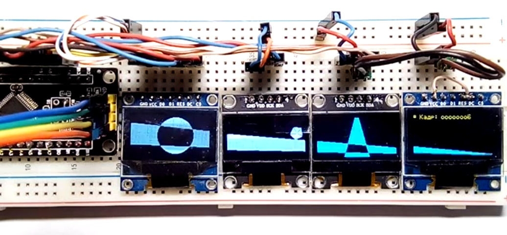

# MDISP++ demonstration
MDISP ++ is a graphics library that supports multiple monochrome graphics displays. It is written in C++ and is a development of the MDISP graphics library. 

This demo project uses an STM32F103C8T as a controller to which four 128x64 SSD1306 based screens are connected.
 
This project created in EmBitz IDE.

## Click below to watch video on youtube:

## Screens connections to the MC GPIO pins:

Screen #  | Interface | I²C Address | MC Pins
----------|-----------|-------------|--------
 All @ SPI|           |             | RST: A12 
 1        |   SPI2    |             | SCK: B13  MOSI: B15  MISO: B14  CS: A10  DC: A11 
 2        |   I²C2    |   0x3c      | SDA: B11 SCL: B10
 3        |   I²C1    |   0x3c      | SDA: B7 SCL: B6
 4        |   I²C1    |   0x3d      | SDA: B7 SCL: B6
 
 
 

